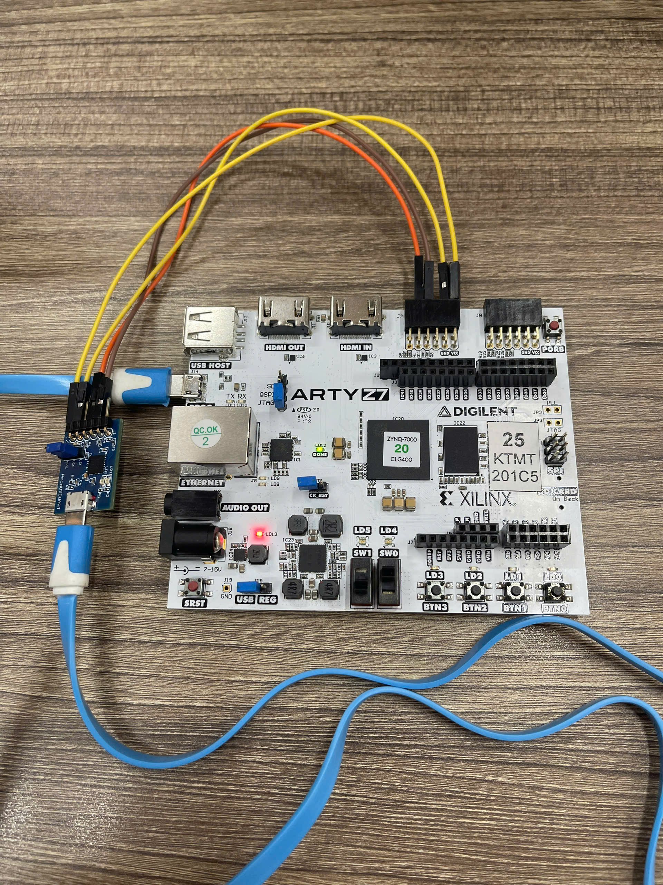

---

# SHA3-256 Hardware Implementation on Arty Z7 via UART

## Overview

This project implements a hardware accelerator for the **SHA3-256** cryptographic hash algorithm on the **Arty Z7 FPGA board** (powered by Xilinx Zynq-7000).

The design offloads the computationally intensive hashing process from the host PC to the FPGA. Data is communicated via a **UART interface** (USB-UART), allowing users to send plaintext messages from a computer (using a Python script) and receive the resulting 256-bit hash calculated by the hardware.

## Features

* **Full SHA3-256 Implementation:** Compliant with FIPS 202 standards using the Keccak-f[1600] permutation.
* **UART Communication:** High-speed asynchronous serial communication (Default: 115200 baud).
* **Custom Bridge Controller:** A dedicated Finite State Machine (FSM) that bridges 8-bit UART data with the 32-bit internal data bus of the SHA3 core.
* **Padding Support:** The wrapper module handles the specific padding rules required for SHA3.
* **Modular Design:** Separated into clear modules for Permutations (Theta, Chi, Iota, RhoPi), Control (Wrapper, Bridge), and Communication (UART RX/TX).

## System Architecture

The data flow of the system is as follows:

`PC (Python) <-> UART (RX/TX) <-> Bridge <-> SHA3 Wrapper <-> SHA3 Core`

### Module Descriptions

1. **`top_system.v`**:
* The top-level entry point.
* Connects the system clock, reset button, and UART RX/TX pins.
* Instantiates the UART modules, the Bridge, and the SHA3 Wrapper.


2. **`bridge_uart_sha3.v`**:
* Acts as the traffic controller.
* **RX Path:** buffers incoming 8-bit UART bytes and packs them into 32-bit words for the SHA3 Wrapper. It detects "End of Line" characters (`0x0D` or `0x0A`) to trigger the hashing process.
* **TX Path:** Unpacks the 32-bit result words from the SHA3 Wrapper back into 8-bit bytes to send to the PC.
* Handles handshaking signals (`valid`, `ready`, `done`).


3. **`wrapper_v4.v`**:
* Manages the state of the Keccak sponge construction.
* Handles the **Absorbing Phase** (XORing input data into the state) and **Padding** (appending the `10...1` bits).
* Controls the number of rounds (24 rounds) via a counter.


4. **`SHA3_v2.v`**:
* The core cryptographic engine.
* Orchestrates the 24 rounds of the Keccak-f[1600] permutation.
* Instantiates the step mapping modules:
* **`Theta.v`**: Calculates parity of columns.
* **`RhoPi.v`**: Performs bitwise rotation (Rho) and coordinate permutation (Pi).
* **`Chi.v`**: Non-linear mapping step (using XOR, NOT, AND).
* **`Iota.v`**: Adds round constants to disrupt symmetry.


5. **`uart_rx.v` & `uart_tx.v**`:
* Standard UART Driver.
* **RX**: Uses 16x oversampling for robust data recovery.
* **TX**: Serializes data for transmission.


## Hardware & Software Requirements

### Hardware

* **Digilent Arty Z7** (or compatible Zynq-7000 development board).
* Micro-USB cable (for JTAG programming and UART communication).

### Software

* **Xilinx Vivado** (Design Suite for synthesis and implementation).
* **Python 3.x** (Host PC).
* **PySerial** library (`pip install pyserial`).

## Getting Started

### 1. FPGA Synthesis (Vivado)

1. Open Vivado and create a new project targeting the Arty Z7 board.
2. Add all the provided `.v` files to the Design Sources.
3. Create a Constraints file (`.xdc`) mapping the ports in `top_system.v`:
* `clk`: Map to the system clock (e.g., 125MHz or 100MHz pin).
* `rst_btn`: Map to a push button (active low logic is handled in top).
* `uart_rx_i`: Map to the FPGA pin connected to USB-UART TX.
* `uart_tx_o`: Map to the FPGA pin connected to USB-UART RX.


4. Run Synthesis, Implementation, and Generate Bitstream.
5. Program the device using the Hardware Manager.

### 2. Python Host Script

Use a Python script to interact with the board. Below is a basic example of how the communication works based on the logic in `bridge_uart_sha3.v`:

```python
import serial
import time
import sys

# ==============================================================================
# CONFIGURATION (MUST CHANGE 'COMx' TO YOUR ACTUAL PORT)
# ==============================================================================
# Windows: 'COMx' (e.g., 'COM3', 'COM4')
# Linux/Mac: '/dev/ttyUSB1' or '/dev/ttyACM0'
PORT_NAME = 'COM6'   
BAUD_RATE = 115200    # Must match the BAUD parameter in Verilog

def run_test():
    try:
        # Open Serial connection
        ser = serial.Serial(PORT_NAME, BAUD_RATE, timeout=2.0)
        print(f"\n[SUCCESS] Connected to {PORT_NAME} at {BAUD_RATE} baud.")
        print("Note: Press the RESET button on the FPGA before starting to ensure a clean state.\n")
        
        while True:
            # 1. Get input from user
            user_input = input(">> Enter string to Hash (type 'exit' to quit): ")
            
            # if user_input.lower() == 'exit':
            #     print("Exiting...")
            #     break
            
            # 2. Send data to FPGA
            # Encode to bytes and add '\n' (0x0A) as delimiter to trigger hash
            data_to_send = user_input.encode('utf-8') + b'\n'
            
            print(f"   [PC -> FPGA] Sending {len(data_to_send) - 1} bytes...")
            ser.write(data_to_send)
            
            # 3. Wait for result (32 bytes = 256 bits)
            start_time = time.time()
            response = ser.read(32)
            end_time = time.time()
            
            # 4. Check and display result
            if len(response) == 32:
                # Convert bytes to Hex string
                hash_hex = response.hex()
                duration = (end_time - start_time) * 1000 # ms
                print(f"   [FPGA -> PC] Received 32 bytes (Response time: {duration:.9f}ms)")
                print(f"   ----------------------------------------------------------------")
                print(f"   RESULT: {hash_hex}")
                print(f"   ----------------------------------------------------------------\n")
            else:
                print(f"   [ERROR] Timeout! Received only {len(response)}/32 bytes.")
                print("   Suggestion: Press RESET on the FPGA and try again.\n")

    except serial.SerialException as e:
        print(f"\n[CONNECTION ERROR] Could not open port {PORT_NAME}.")
        print("1. Check the USB cable.")
        print("2. Check if the COM port is correct (in Device Manager).")
        print("3. Close other software occupying the COM port (like TeraTerm, Putty).")
        print(f"Error details: {e}")
    except Exception as e:
        print(f"\n[UNKNOWN ERROR]: {e}")
    finally:
        if 'ser' in locals() and ser.is_open:
            ser.close()
            print("[INFO] Serial port closed.")

if __name__ == "__main__":
    run_test()

```

## Protocol Details

The `bridge_uart_sha3` module defines a specific state machine for communication:

1. **Idle**: The FPGA waits for UART data.
2. **Accumulation**: Incoming bytes are buffered into 32-bit words.
3. **Trigger**: When `0x0D` (CR) or `0x0A` (LF) is received, the bridge asserts the `done` signal to the wrapper.
4. **Processing**: The Wrapper pads the message and the SHA3 core runs for 24 rounds.
5. **Output**: Once valid output is ready, the bridge sends 32 bytes (256 bits) back over UART.

## Setup interface on the ArtyZ7-20 board


## Video-Checking
<video src="./Checking_SHA3_256.mp4" controls="controls" style="max-width: 100%;">
</video>

## Notes

* **Clock Frequency**: Ensure the `CLK_FREQ` parameter in `top_system.v` matches your board's oscillator (default is set to 125MHz).
* **RhoPi**: Ensure `RhoPi.v` contains the correct bit-shifting and permutation logic (the provided source snippet for this file appeared empty and may need the implementation logic added).

